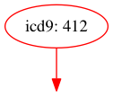

# ConceptQL

ConceptQL (pronounced concept-Q-L) is a high-level language that allows researchers to unambiguously define their research algorithms.

This gem interprets the ConceptQL language and translates it into SQL queries compatible with OMOP CDM-structured data.  The ConceptQL "language" is a set of nested hashes and arrays representing search criteria and some set operations and temporal operations to glue those criteria together.

## Further Reading

If you're interested in reading up on ConceptQL, a rough draft of the specifications document is [available in markdown format](https://github.com/outcomesinsights/conceptql_spec).

## Motivation for ConceptQL

Outcomes Insights intends to build a vast library of research algorithms and apply those algorithms to large databases of claims data.  Early into building the library, we realized we had to overcome two major issues:

1. Methods sections of research papers commonly use natural language to specify the criteria used to build cohorts from a claims database.
    - Algorithms defined in natural language are often imprecise, open to multiple interpretations, and generally difficult to reproduce.
    - Researchers could benefit from a language that removes the ambiguity of natural language while increasing the reproducibility of their research algorithms.
1. Querying against claims databases is often difficult.
    - Hand-coding algorithms to extract cohorts from datasets is time-consuming, error-prone, and opaque.
    - Researchers could benefit from a language that allows algorithms to be defined at a high-level and then gets translated into the appropriate queries against a database.

We developed ConceptQL to address these two issues.

We are writing a tool that can read research algorithms defined in ConceptQL.  The tool can create a diagram for the algorithm which makes it easy to visualize and understand.  The tool can also translate the algorithm into a SQL query which runs against data structured in [OMOP's Common Data Model (CDM)](http://omop.org/CDM).  The purpose of the CDM is to standardize the format and content of observational data, so standardized applications, tools and methods can be applied to them.

For instance, using ConceptQL we can take a statement that looks like this:

```YAML
:icd9: '412'
```

And generate a diagram that looks like this:



And generate SQL that looks like this:

```SQL
SELECT *
FROM cdm_data.condition_occurrence AS co
JOIN vocabulary.source_to_concept_map AS scm ON (c.condition_concept_id = scm.target_concept_id)
WHERE scm.source_code IN ('412')
AND scm.source_vocabulary_id = 2
AND scm.source_code = co.condition_source_value
```

As stated above, one of the goals of ConceptQL is to make it easy to assemble fairly complex queries without having to roll up our sleeves and write raw SQL.  To accommodate this complexity, ConceptQL itself has some complexities of its own.  That said, we believe ConceptQL will help researchers define, hone, and share their research algorithms.

## Try Before You Buy

If you'd like to interact with ConceptQL a bit before deciding to dive in, head over to the [ConceptQL Sandbox](http://sandbox.cohortjigsaw.com) for an online demonstration of the language and its features.

## Requirements

ConceptQL is in an early-alpha state.  For now it is limited to working with [OMOP CDM](http://omop.org/CDM)-structured data stored in the [PostgreSQL](http://www.postgresql.org/) database.  It has been tested under [Ubuntu Linux](http://www.ubuntu.com/) and Mac OS X 10.8+.  The interpreter is written in Ruby and theoretically should be platform independent, but your mileage may vary.

Specifically, ConceptQL needs:

- Ruby 2.0+
- PostgresQL 9.3+
- Ruby's [Bundler](http://bundler.io/) gem
- A PostgreSQL database with
    - OMOP CDM-structured data stored in the public schema
    - The OMOP Vocabularies stored in a schema named 'vocabulary'
        - You may want to use [loadmop](http://github.com/outcomesinsights/loadmop) to quickly create the OMOP vocabulary schema

## Installation

Add this line to your application's Gemfile:

    gem 'conceptql'

And then execute:

    bundle

Or install it yourself as:

    gem install conceptql

## Usage

ConceptQL comes with a [Thor](http://whatisthor.com/)-based command-line program: `conceptql`

`conceptql` allows you to translate a ConceptQL statement into a SQL statement or a graph depicting the ConceptQL statement.

`conceptql` will print a basic help menu for each command if you run `conceptql`

## Writing Your Own ConceptQL

Right now, the only way to create a new ConceptQL statement is to write it out by hand in either Ruby, JSON, or YAML.

If you're feeling bold, feel free to try your hand at authoring a ConceptQL statement.

## Testing

### Setup

In order to run the tests for ConceptQL, you first have to create a database and load the OMOP vocabularies into it.  You can use [loadmop](https://github.com/outcomesinsights/loadmop/tree/develop) do to so.

Follow the instructions in [loadmop](https://github.com/outcomesinsights/loadmop/#preparation) to setup the vocabulary files correctly.

After loading the vocabulary data file into the database,
create an .env file in the root of the conceptql directory,
similar or identical to the one used for loadmop.  Then
run `rake test_db_setup`.  This will load the ConceptQL test
data into the database.  This only needs to be done once, not
every time you run the tests.

### Running

If any of the CSV files in `test/data` has been updated since you
last updated the database, you should run `rake test_db_teardown test_db_setup`
to reset the data in the database.  Updates to the CSV files in
`test/data` should be infrequent.

After the test database has been setup, you can run the tests
using `rake`, as the default task is set to run the tests.

## Contributing

1. Fork it ( [http://github.com/outcomesinsights/conceptql/fork](http://github.com/outcomesinsights/conceptql/fork) )
1. Create your feature branch (`git checkout -b my-new-feature`)
1. Commit your changes (`git commit -am 'Add some feature'`)
1. Push to the branch (`git push origin my-new-feature`)
1. Create new Pull Request

Or, use the [conceptql-dev-box](https://github.com/outcomesinsights/conceptql-dev-box) to get yourself setup and hack on ConceptQL that way.

## Thanks

- [Outcomes Insights, Inc.](http://outins.com)
    - Many thanks for allowing me to release a portion of my work as Open Source Software!
- [OMOP](http://omop.org)/[OHDSI](http://www.ohdsi.org/)
    - Thank you for providing a great [Common Data Model](http://omop.org/CDM) and fantastic set of standardized [Vocabularies](http://omop.org/Vocabularies) upon which ConceptQL rests.
